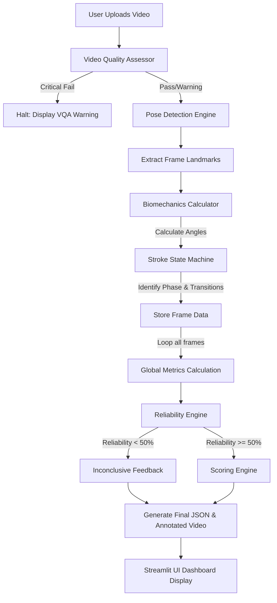

# Swim Analyzer AI - Comprehensive User Guide

Welcome to **Swim Analyzer AI**, a professional-grade swimming performance analysis platform. This application leverages advanced computer vision, pose estimation, and biomechanical heuristics to automatically extract and analyze swimming technique from a single monocular video.

---

## 🌟 Core Features & Capabilities

### 1. Video Quality Assessment (VQA) Pre-Check
Before any heavy processing begins, the app evaluates the incoming video to ensure it meets the requirements for accurate analysis.
*   **Checks Performed**: Lighting, camera angle, blur, swimmer visibility, occlusions, and stability.
*   **Actionable Feedback**: If the video is poor, the app explicitly tells you *why* (e.g., "Camera angle is incorrect"), *what effect it has* (e.g., "Shoulder angles become unreliable"), and *how to fix it* (e.g., "Record perpendicular to the lane").
*   **Critical Fails**: If the video is unusable, the app halts processing to save time and prevent garbage data.

### 2. Stroke Phase State Machine
The AI breaks down every single swimming stroke into its deterministic biomechanical phases:
*   **Entry** -> **Catch** -> **Pull** -> **Push** -> **Recovery**
*   **Robust Cycle Counting**: Intelligently ignores missing frames or bad tracking to accurately count the total number of strokes and calculate the average time spent in each phase.
*   **Camera Angle Detection**: Automatically adjusts heuristics depending on whether the camera is side-on or front-facing (head-on).

### 3. Biomechanics & Technique Analysis
Extracts continuous timeseries data for critical joints:
*   **Measured Angles**: Left/Right Elbows, Shoulders, Knees, and Body Roll.
*   **Global Metrics**: Calculates **Stroke Rate** (spm), **Stroke Length**, **Stroke Symmetry** (%), and **Kick Frequency** (Hz).
*   **Error Detection**: Automatically flags flaws like "Dropped Elbows", "Asymmetrical Pulls", "Limited Shoulder Extension", or "Excessive Knee Bending" with an attached severity level.

### 4. Tri-Pillar Reliability Engine
The app protects users from misleading results by grading every analysis across three independent pillars:
1.  **Video Quality Score (0-100)**: How good the raw MP4 file was.
2.  **Analysis Confidence (0-100)**: How well the AI's pose estimation was able to track the human body.
3.  **Analysis Reliability (0-100)**: How mathematically trustworthy the extracted biomechanics are. (If the reliability drops below 50%, the app will refuse to issue coaching feedback, marking the run as "Inconclusive").

### 5. Configurable Visualization Modes
*   **User Mode**: Clean UI showing only the final annotated video with basic skeletons, final scores, and coaching feedback.
*   **Coach Mode**: Overlays joint angles, stroke phase names, and key biomechanical metrics directly onto the video.
*   **Developer Mode**: A granular, frame-by-frame debug overlay showing temporal trajectories (tails), confidence scores, and raw coordinate tracking.

### 6. Ground Truth Validation Framework
*   For researchers and maintainers, the app includes a headless CLI (`validate.py`) capable of ingesting synthetic/manually labeled JSON files and proving the exact mathematical accuracy (MAE, RMSE, F1) of the AI engine.

---

## 🚀 How to Use the App

### Step 1: Starting the Application
1. Open your terminal/command prompt.
2. Navigate to the project directory: `cd D:\AI_Projects\Swim_Analyzer_AI`
3. Launch the Streamlit server:
   ```bash
   streamlit run app/streamlit_app.py
   ```
4. The web dashboard will open in your default browser.

### Step 2: Uploading a Video
1. Use the left sidebar to click **"Browse files"** or drag-and-drop your `.mp4`, `.mov`, or `.avi` swimming recording.
2. Ensure your video ideally shows the swimmer from a side-profile or front-on view with minimal splashing obscuring the joints.

### Step 3: Configuring Settings
1. **Effective FPS**: The app attempts to read the framerate automatically. If you recorded in slow-motion, you can override this value to correct the temporal math (e.g., stroke rate).
2. **Mode Selection**: Choose between *User*, *Coach*, or *Developer* mode from the dropdown based on how much overlay data you want on the final output video.
3. Click the red **"Analyze Swimming Technique"** button.

### Step 4: Understanding the Results
Once processing finishes, you are presented with:
*   **Analysis Summary Top-Row**: A quick glance at your Technique Score, VQA, Confidence, and Reliability.
*   **Annotated Video**: A downloadable MP4 with the AI overlays drawn directly on top.
*   **Key Metrics**: Displays calculated Rate, Length, Symmetry, and Kick Frequency. 
    *   *(Note: Metrics marked as `(est)` are estimated. Metrics marked as `Invalid` or `N/A` lacked the reliable data required to generate them).*
*   **Raw Data Charts**: A secondary tab containing interactive line charts showing joint angles graphed over time, and a breakdown of time spent in each stroke phase.

---

## 🔄 Internal Workflow (Architecture Flowchart)


