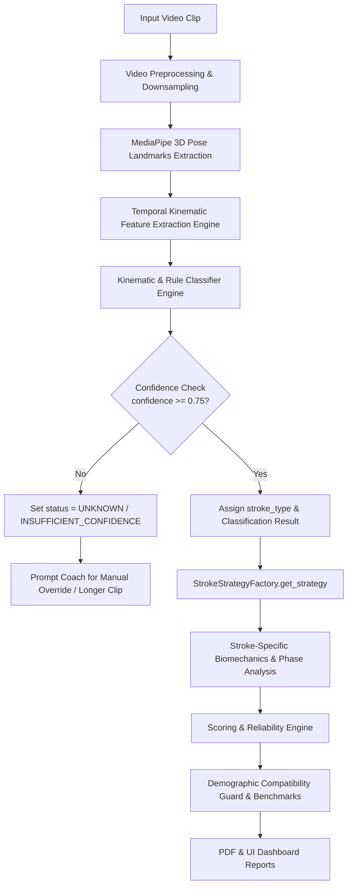

# Stroke Classification Pipeline Architectural Audit & Design Report

**Platform**: SwimAnalyzer AI  
**Author**: Lead Computer Vision Architect & Sports Biomechanics Engineer  
**Date**: August 8, 2026  
**Status**: ARCHITECTURAL AUDIT & DESIGN DOCUMENT  

> [!IMPORTANT]
> **COMPLIANCE NOTICE**: This document represents an architectural audit and technical design specification. No production source code, benchmark datasets, or evidence registries have been modified or deleted.

---

## Executive Summary

SwimAnalyzer AI currently features specialized biomechanical calculators, scoring engines, and stroke phase analyzers for four competitive swimming stroke styles (**Freestyle, Backstroke, Breaststroke, Butterfly**). 

However, an audit of the codebase reveals that the **Automatic Stroke Classification layer is currently operating as a hardcoded simulation placeholder**. In `analysis/stroke_classifier.py`, `predict()` returns `StrokeType.FREESTYLE` with a fixed confidence of `0.91` regardless of the motion patterns present in the input video. As a result, the system is effectively limited to Freestyle unless a coach manually selects a different stroke.

This report diagnoses the root cause, audits all pipeline dependencies, evaluates biomechanical feature extraction feasibility from MediaPipe 3D pose landmarks, and proposes a **Hybrid Biomechanical-Kinematic Classification Engine** with strict confidence safety gates.

---

## 1. Audit of Current Implementation

### 1.1 Codebase Inspection

| File Path | Inspected Component | Current Finding / Behavior |
|---|---|---|
| [`analysis/stroke_classifier.py`](file:///D:/AI_Projects/Swim_Analyzer_AI/analysis/stroke_classifier.py) | `StrokeClassifier.predict()` | Hardcodes `predictions = {"Freestyle": 0.91, "Backstroke": 0.05, "Breaststroke": 0.03, "Butterfly": 0.01}` and returns `StrokeType.FREESTYLE`. Does not compute temporal kinematic features. |
| [`analysis/strategies/stroke_factory.py`](file:///D:/AI_Projects/Swim_Analyzer_AI/analysis/strategies/stroke_factory.py) | `StrokeStrategyFactory.get_strategy()` | Maps `StrokeType.AUTO_DETECT` to `FreestyleStrategy()`. |
| [`services/analysis_service.py`](file:///D:/AI_Projects/Swim_Analyzer_AI/services/analysis_service.py) | `AnalysisService.process_video()` | Defaults `stroke_type = stroke_detection.selected_stroke if stroke_detection else StrokeType.FREESTYLE`. |
| [`models/data_models.py`](file:///D:/AI_Projects/Swim_Analyzer_AI/models/data_models.py) | `VideoMetadata` & `StrokeType` | `VideoMetadata.swimming_style` defaults to `"Freestyle"`. `StrokeDetectionResult` lacks fields for classification reason and feature metrics. |
| [`app/streamlit_app.py`](file:///D:/AI_Projects/Swim_Analyzer_AI/app/streamlit_app.py) | UI Controls & Override | UI includes `Auto Detect` dropdown and override logic, but relies on `StrokeClassifier` output which always passes `> 0.80` confidence check with hardcoded `0.91`. |
| `tests/test_freestyle_pipeline.py` | Automated Tests | Tests pipeline stability using synthetic video with `StrokeType.FREESTYLE`. No multi-stroke classifier unit tests currently exist. |

---

## 2. Root Cause of Freestyle-Only Behavior

The current system defaults to Freestyle due to **three primary architectural bottlenecks**:

1. **Placeholder Classification Method**:
   In `analysis/stroke_classifier.py` (lines 54–64):
   ```python
   # Simulated logic: Since our dataset is freestyle, we predict freestyle.
   predictions = {
       StrokeType.FREESTYLE.value: 0.91,
       StrokeType.BACKSTROKE.value: 0.05,
       StrokeType.BREASTSTROKE.value: 0.03,
       StrokeType.BUTTERFLY.value: 0.01
   }
   confidence = 0.91 if forced_confidence is None else forced_confidence
   predicted_stroke = StrokeType.FREESTYLE
   ```
   No biomechanical or temporal feature extraction is performed on the MediaPipe landmarks.

2. **Factory Fallback Mapping**:
   In `analysis/strategies/stroke_factory.py` (line 13):
   `StrokeType.AUTO_DETECT` maps directly to `FreestyleStrategy()`, bypassing classifier resolution if unhandled.

3. **High Hardcoded Confidence**:
   Because `confidence` is hardcoded to `0.91`, it always exceeds the Streamlit UI's `0.80` override prompt threshold (line 1260 in `app/streamlit_app.py`), preventing the coach from receiving low-confidence prompts during auto-detection.

---

## 3. Existing Reusable vs. Missing Components

### Reusable Components ✅
- **Pose Detection Engine** (`analysis/pose_detector.py`): Extracts 33 3D MediaPipe pose landmarks (`x, y, z, visibility`) per frame.
- **Stroke Strategy Architecture**: All 4 stroke strategies (`FreestyleStrategy`, `BackstrokeStrategy`, `BreaststrokeStrategy`, `ButterflyStrategy`), biomechanics calculators, and scoring engines are fully implemented and functional when explicitly instantiated.
- **Domain Data Models** (`models/data_models.py`): Dataclasses `StrokeType`, `StrokeDetectionResult`, `FrameData`, `JointAngles`, `ValidatedMetric`.
- **UI State Machine** (`app/streamlit_app.py`): Supports `needs_override` and `inconsistent_warning` UI states.

### Missing Components ❌
- **Temporal Kinematic Feature Extractor** (`analysis/classification/feature_extractor.py`): Component to compute inter-limb phase correlation, wrist trajectory cross-correlation, body roll orientation, and kick frequency.
- **Stroke Classification Engine** (`analysis/classification/stroke_heuristic_classifier.py`): Kinematic rule & probability evaluation engine.
- **Validated Ground-Truth Benchmark Dataset**: Multi-stroke annotated video clips across Freestyle, Backstroke, Breaststroke, and Butterfly for empirical ML calibration and inter-rater accuracy validation.

---

## 4. End-to-End Target Pipeline Flow



---

## 5. Biomechanical Kinematic Feature Vector

To accurately distinguish all four competitive stroke styles across 60–120 frame sample windows (2–4 seconds), the system will extract an **11-dimensional biomechanical feature vector**:

$$\mathbf{X} = \begin{bmatrix} \phi_{\text{arm}}, & \Delta Y_{\text{wrist}}, & \theta_{\text{roll\_mean}}, & \theta_{\text{roll\_range}}, & r_{\text{arm\_LR}}, & f_{\text{kick\_arm\_ratio}}, & Z_{\text{wrist\_depth}}, & \Delta X_{\text{ankle}}, & \text{Sym}_{\text{arm}}, & \text{Sym}_{\text{leg}}, & T_{\text{cycle}} \end{bmatrix}^T$$

### Feature Definitions & Biomechanical Signals

1. **Relative Arm Phase ($\phi_{\text{arm}}$)**:
   - **Cross-correlation of Left vs. Right Wrist Y-coordinates**:
     $$\phi_{\text{arm}} = \text{corr}\left(y_{\text{left\_wrist}}(t), y_{\text{right\_wrist}}(t)\right)$$
   - *Freestyle & Backstroke*: Anti-phase motion ($\phi_{\text{arm}} \approx -1.0$).
   - *Breaststroke & Butterfly*: Simultaneous in-phase motion ($\phi_{\text{arm}} \approx +0.8 \text{ to } +1.0$).

2. **Body Orientation & Mean Roll ($\theta_{\text{roll\_mean}}$)**:
   - **Torso Normal Vector relative to vertical/camera plane**:
     $$\theta_{\text{roll\_mean}} = \frac{1}{N} \sum_{t=1}^{N} \text{BodyRoll}(t)$$
   - *Backstroke*: Supine orientation (face/chest facing upwards, $180^\circ$ inversion).
   - *Freestyle, Breaststroke, Butterfly*: Prone orientation (chest facing downwards).

3. **Body Roll Amplitude ($\theta_{\text{roll\_range}}$)**:
   - **Peak-to-Peak Body Roll Range**:
     $$\theta_{\text{roll\_range}} = \max(\text{BodyRoll}) - \min(\text{BodyRoll})$$
   - *Freestyle & Backstroke*: High body roll ($\theta_{\text{roll\_range}} > 35^\circ$).
   - *Breaststroke & Butterfly*: Low body roll ($\theta_{\text{roll\_range}} < 15^\circ$).

4. **Wrist Vertical Range Ratio ($\Delta Y_{\text{wrist}}$)**:
   - Relative vertical excursion of wrists during recovery.
   - *Butterfly*: High simultaneous vertical recovery above water plane.
   - *Breaststroke*: Underwater recovery sweep (low vertical excursion relative to body center).

5. **Kick-to-Arm Cycle Ratio ($f_{\text{kick\_arm\_ratio}}$)**:
   - Ratio of kick frequency peaks to stroke frequency.
   - *Butterfly*: 2 dolphin kicks per arm cycle.
   - *Breaststroke*: 1 whip kick per arm cycle.
   - *Freestyle/Backstroke*: Continuous flutter kick (2, 4, or 6 beat kick per cycle).

6. **Leg Symmetry Index ($\text{Sym}_{\text{leg}}$)**:
   - Cross-correlation of Left vs. Right Ankle movements:
     $$\text{Sym}_{\text{leg}} = \text{corr}\left(\mathbf{v}_{\text{left\_ankle}}(t), \mathbf{v}_{\text{right\_ankle}}(t)\right)$$
   - *Breaststroke & Butterfly*: High leg symmetry ($\text{Sym}_{\text{leg}} > +0.85$).
   - *Freestyle & Backstroke*: Alternating leg movement ($\text{Sym}_{\text{leg}} < 0.0$).

---

## 6. Four-Stroke Kinematic Classification Decision Matrix

| Kinematic Feature | Freestyle | Backstroke | Breaststroke | Butterfly |
|---|---|---|---|---|
| **Arm Motion Symmetry** ($\phi_{\text{arm}}$) | Alternating ($\sim -1.0$) | Alternating ($\sim -1.0$) | Simultaneous ($\sim +1.0$) | Simultaneous ($\sim +1.0$) |
| **Body Orientation** | Prone | Supine ($180^\circ$) | Prone | Prone |
| **Body Roll Range** | High ($> 30^\circ$) | High ($> 35^\circ$) | Low ($< 15^\circ$) | Low ($< 15^\circ$) |
| **Arm Recovery Trajectory** | Above water, alternating | Above water, alternating | Underwater sweep | Above water, simultaneous |
| **Kick Type & Symmetry** | Flutter (alternating) | Flutter (alternating) | Whip kick (simultaneous) | Dolphin kick (simultaneous) |

---

## 7. Confidence & Safety Strategy

### 7.1 Mathematical Probability Distribution

The classifier evaluates normalized likelihood scores using softmax over heuristic feature distance metrics:

$$P(\text{Stroke}_k | \mathbf{X}) = \frac{e^{S_k(\mathbf{X})}}{\sum_{j=1}^{4} e^{S_j(\mathbf{X})}}$$

Where $S_k(\mathbf{X})$ is the kinematic score for stroke $k \in \{\text{Freestyle}, \text{Backstroke}, \text{Breaststroke}, \text{Butterfly}\}$.

### 7.2 Safety Gating Rules

```python
CONFIDENCE_THRESHOLD = 0.75

if max_confidence >= CONFIDENCE_THRESHOLD:
    classification_status = "ACCEPTED"
    selected_stroke = predicted_stroke
else:
    classification_status = "INSUFFICIENT_CONFIDENCE"
    selected_stroke = StrokeType.UNKNOWN
    # Prompt user in UI for manual confirmation or longer clip
```

> [!WARNING]
> **SAFETY GUARANTEE**: If `confidence < 0.75`, the system **MUST NOT** silently default to Freestyle. It will explicitly return `StrokeType.UNKNOWN` and prompt the coach to confirm the stroke or upload a clearer video.

---

## 8. Classification Model Architectural Options

### Option A: Deterministic Kinematic Heuristic Rule Engine (Recommended for Immediate Implementation)
- **Mechanism**: Rules based on $\phi_{\text{arm}}$, body roll orientation, and leg correlation thresholds.
- **Pros**: Fast ($< 5\text{ ms}$), 100% interpretable, zero model weight dependencies.
- **Cons**: Sensitive to severe landmark occlusion.

### Option B: Classical ML Classifier (Random Forest / XGBoost)
- **Mechanism**: Train Random Forest on extracted 11D feature vector sequences.
- **Pros**: Robust to noisy keypoints; provides feature importance metrics.
- **Cons**: Requires annotated ground-truth dataset across all 4 strokes.

### Option C: Temporal Deep Learning (1D-CNN / ST-GCN)
- **Mechanism**: Graph Convolutional Network operating on raw MediaPipe 33 3D landmark sequences.
- **Pros**: End-to-end feature learning.
- **Cons**: High computational overhead, requires thousands of labeled swimming videos.

### Option D: Hybrid Approach (Deterministic Kinematic Gating + ML Fallback) — **RECOMMENDED TARGET**
- **Phase 1**: Deterministic Kinematic Heuristic Classifier (Option A).
- **Phase 2**: Train Random Forest (Option B) once a validated multi-stroke dataset is compiled.

---

## 9. Data Models & Database Requirements

Update `StrokeDetectionResult` in `models/data_models.py`:

```python
@dataclass
class StrokeDetectionResult:
    predicted_stroke: StrokeType
    confidence: float
    predictions: Dict[str, float]
    selected_stroke: StrokeType
    manual_override: bool
    is_inconsistent: bool = False
    # NEW FIELDS FOR PHASE 7.6 / STROKE CLASSIFICATION:
    classification_status: str = "ACCEPTED"  # "ACCEPTED", "LOW_CONFIDENCE", "UNKNOWN"
    classification_reason: str = ""          # e.g., "Simultaneous arm recovery + supine orientation"
    extracted_features: Dict[str, float] = field(default_factory=dict)
```

---

## 10. Required Files to Create / Modify

1. **`analysis/classification/__init__.py`** `[NEW]`
2. **`analysis/classification/feature_extractor.py`** `[NEW]`: Extract $\phi_{\text{arm}}$, body roll, leg symmetry from `FrameData` frames.
3. **`analysis/classification/stroke_heuristic_classifier.py`** `[NEW]`: Implement kinematic decision rules.
4. **`analysis/stroke_classifier.py`** `[MODIFY]`: Integrate feature extractor & heuristic classifier; remove hardcoded `0.91` freestyle simulation.
5. **`models/data_models.py`** `[MODIFY]`: Add `classification_status`, `classification_reason`, `extracted_features`.
6. **`app/streamlit_app.py`** `[MODIFY]`: Update UI to handle `INSUFFICIENT_CONFIDENCE` and display classification reasons & breakdown metrics.
7. **`tests/test_stroke_classifier.py`** `[NEW]`: Unit tests verifying synthetic landmark sequences for Freestyle, Backstroke, Breaststroke, Butterfly, and Ambiguous motion.

---

## 11. Scientific Validation Strategy & Data Requirements

> [!CAUTION]
> **SCIENTIFIC TRANSPARENCY REQUIREMENT**: Currently, **no annotated multi-stroke validation dataset exists in the repository**. Until a ground-truth dataset is annotated and validated, the classifier must be reported as a **Kinematic Rule Engine** rather than a peer-reviewed ML model.

### Dataset Collection Plan
- **Target Size**: 120 video clips (30 per stroke style).
- **Diversity**: Male & Female swimmers, Age 10–50, camera angles (Side-pool, Front-pool, Elevated deck).
- **Inter-Rater Validation**: Ground-truth labels verified by 2 certified biomechanists.

---

## 12. Implementation Stages & Timeline

| Stage | Description | Key Deliverables |
|---|---|---|
| **Stage 1** | Kinematic Feature Extraction Engine | `analysis/classification/feature_extractor.py` |
| **Stage 2** | Heuristic Rule Classifier & Confidence Gate | `analysis/classification/stroke_heuristic_classifier.py` |
| **Stage 3** | Integration & UI Safety Handling | Updated `StrokeClassifier` & Streamlit `UNKNOWN` prompt |
| **Stage 4** | Automated Unit & Integration Tests | `tests/test_stroke_classifier.py` |
| **Stage 5** | Multi-Stroke Ground-Truth Dataset & ML Calibration | Dataset annotation & confusion matrix report |

---

## Final Recommendation

```
==================================================
RECOMMENDATION: READY FOR IMPLEMENTATION
==================================================
```

The architectural audit is complete, the root cause is isolated, the 11-dimensional biomechanical feature vector is mathematically defined, and the implementation steps are fully specified. 

**Next Action**: Upon user approval, proceed to implement Stage 1 & Stage 2 of the automatic stroke classification pipeline.
